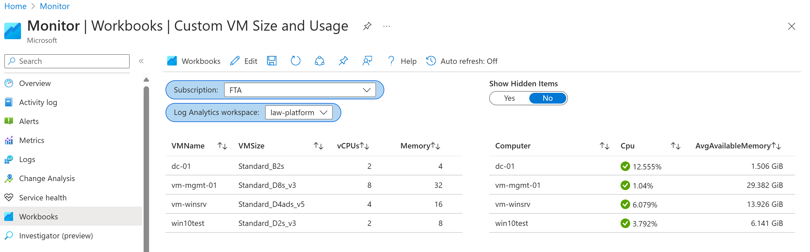

# Custom VM Size Usage Workbook

This document provides an overview of the `Custom-VM-Size-Usage.json` file, which is designed to offer insights into the usage and performance of Azure VMs. The Workbook is structured to assist understanding at a glance based on the VM sku the provisioned vCPUs, Memory size then CPU and Memory usage

## Overview

This JSON file represents a workbook in Azure Monitor. It contains a collection of items that define various queries and parameters used in the workbook. The workbook is designed to display information about virtual machine sizes and usage in an Azure environment.

## Key Components

- **CPU Provisioned**: Displays the number of CPUs that is provisioned to the VMs.
- **Available Memory**: Shows the memory in megabytes (MB), provided to the VMs.
- **Memory Usage**: Indicates the total memory usage, which is critical for assessing if the VM sizes meet the workload demands.
- **CPU Usage**: Displays the percentage of CPU utilization, helping identify VMs that are over or under-utilized.

## Configuration Details

 The structure of the JSON file is as follows:
 - version: The versionf the notebook.
 - items: An array of items that define the queries and parameters used in the workbook.
   - type: The type of the item.
   - content: The content of the item, which includes the query or parameter details.
   - customWidth: The custom width of the item in the workbook.
   - name: The name of the item.
 - fallbackResourceIds: An array of fallback resource IDs.
 - $schema: The schema of the workbook.
 
## Customization

Users can customize the report to fit their specific needs by adjusting the Kusto Query Language (KQL) queries, threshold values, and visualization options. This flexibility allows for a tailored view that matches the unique requirements of each environment.

## Usage

To use this report, import the `Custom-VM-Size-Usage.json` file into Azure Monitor Workbooks. Once imported, the report will automatically populate with data from your Azure environment, assuming the necessary monitoring and diagnostics settings are enabled.

You can deploy the workbook by clicking on the button below: 

 

## Conclusion

The Custom VM Size Usage report is an essential tool for administrators looking to optimize environments. By providing detailed insights into VM performance and usage trends, it enables informed decision-making regarding VM sizing and resource allocation.

 

For more information on configuring and using Azure Monitor Workbooks, please refer to the [official documentation](https://docs.microsoft.com/azure/azure-monitor/visualize/workbooks-overview).
